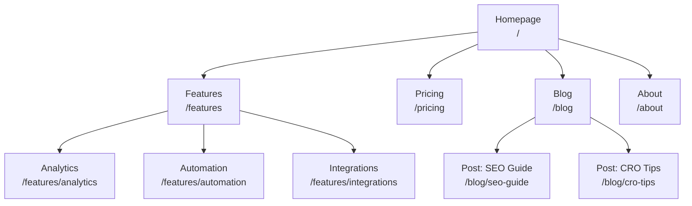
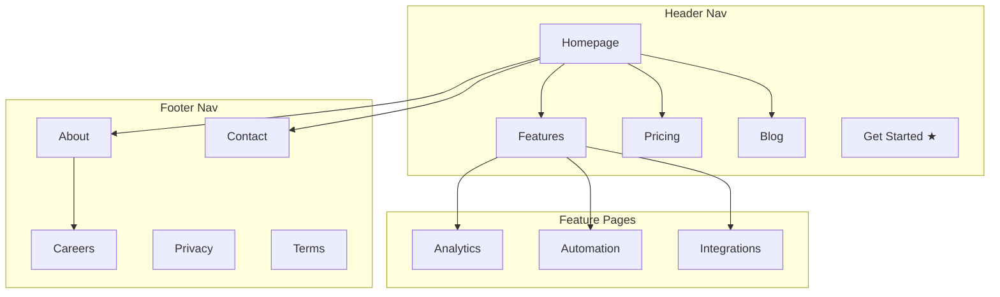
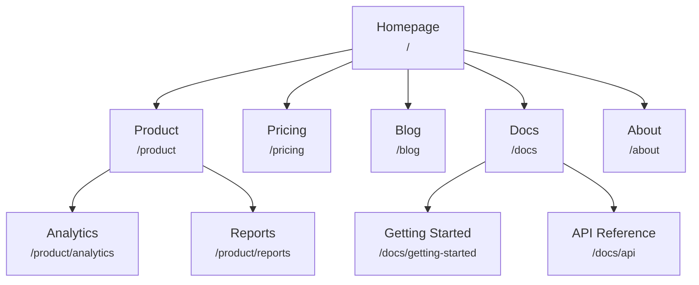
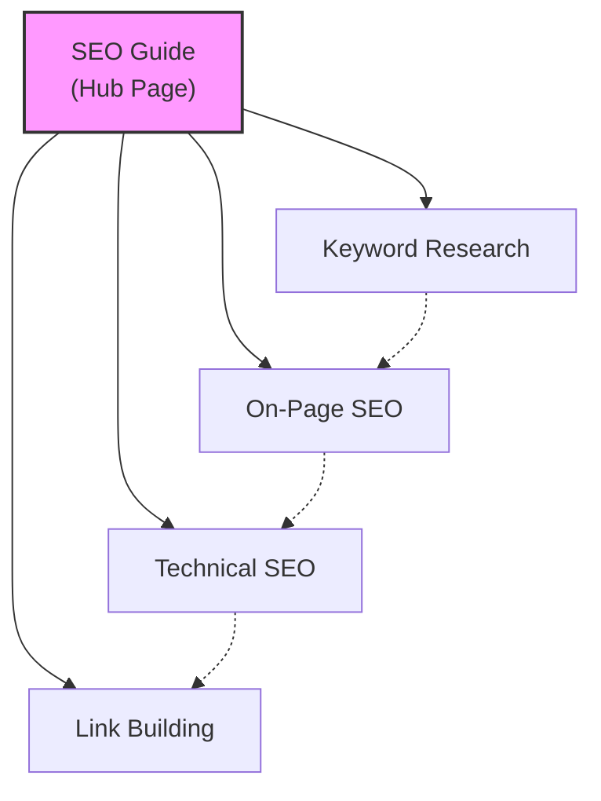
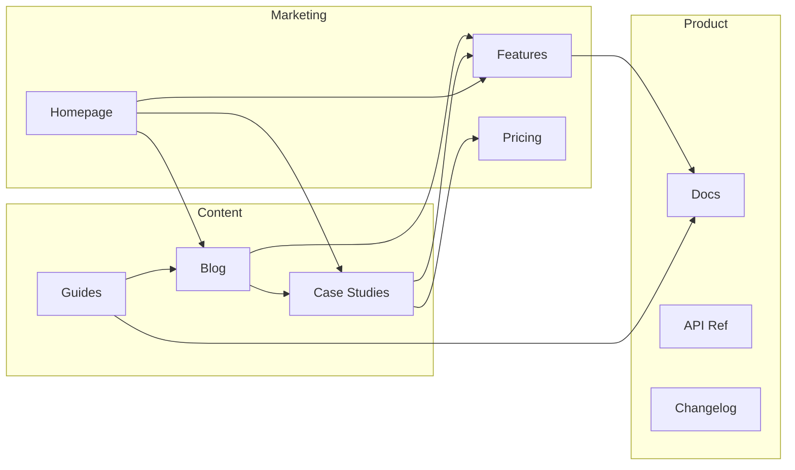
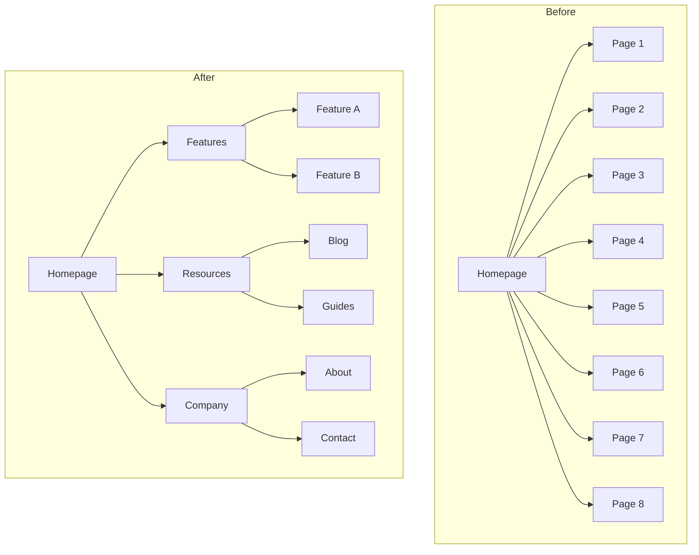
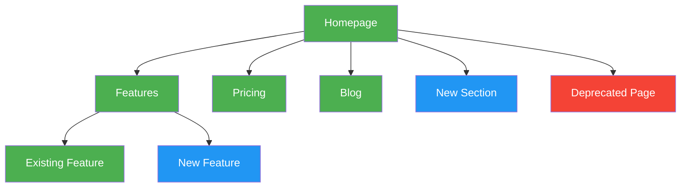

# Templates de diagrammes Mermaid

Diagrammes Mermaid prêts à copier-coller pour des sitemaps visuels. Personnalisez les libellés de nœuds et les connexions pour votre site.

---

## Hiérarchie de base

Hiérarchie de pages simple de haut en bas.

---

## Hiérarchie avec zones de navigation

Utilise des subgraphs pour montrer quelles pages apparaissent dans quelle zone de navigation.

---

## Hiérarchie avec libellés d'URL

Chaque nœud affiche le nom de la page et le chemin d'URL.

---

## Modèle de contenu hub-and-spoke

Montre une page hub connectée à des articles spokes, avec des spokes se liant entre eux.

Légende :
- Lignes pleines = liens hub-spoke principaux
- Lignes pointillées = liens croisés entre spokes

---

## Flux de maillage interne

Montre comment les différentes sections du site se lient entre elles.

---

## Avant/Après restructuration

Comparez côte à côte la structure actuelle et la structure proposée.

---

## Conventions de code couleur

Utilisez les styles pour mettre en évidence le statut, la priorité ou le type de page.

Clé des couleurs :
- **Vert** (`#4CAF50`) : pages existantes (aucun changement)
- **Bleu** (`#2196F3`) : nouvelles pages à créer
- **Rouge** (`#f44336`) : pages à supprimer ou rediriger
- **Jaune** (`#FFC107`) : pages à restructurer ou déplacer
- **Violet** (`#9C27B0`) : pages haute priorité / CTA
